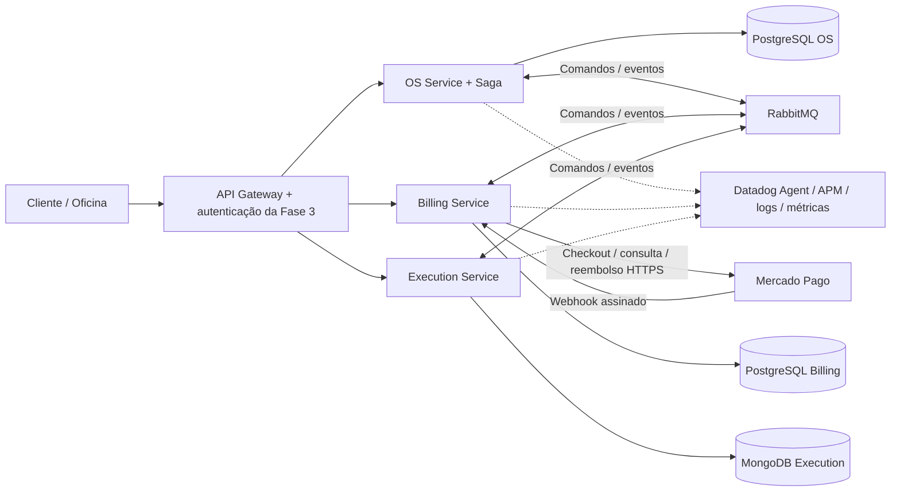

# Arquitetura proposta e migração

## Divisão por capacidade de negócio

OS mantém identidade do cliente/veículo e a visão pública do ciclo de vida. Billing é dono da versão aprovada do orçamento e do ledger de pagamentos. Execution é dono da operação física e da disponibilidade de peças. Relacionamentos entre serviços usam IDs e snapshots versionados, sem foreign keys ou joins entre bancos.

O monólito possui `customers`, `vehicles`, `service-catalog`, `stock-items` e `service-orders`. Hoje `open-service-order.use-case.ts` cria cliente, veículo e OS em uma transação local; orçamento e execução ainda alteram a mesma entidade. A extração deve preservar as validações de CPF/CNPJ, placa, vínculo cliente/veículo, preços, quantidades e estoque. Não substituir essas regras pelos modelos simplificados do protótipo.

## Topologia alvo (ainda não implantada)

Cada repositório deve possuir Dockerfile, migrations, configuração de infraestrutura, manifestos do seu serviço/banco e pipeline. O cluster compartilhado da Fase 3 pode hospedar os serviços em namespaces próprios, com credenciais e políticas de rede exclusivas. Uma infraestrutura compartilhada de broker não autoriza compartilhar dados de domínio.

Proposta de bancos: duas instâncias PostgreSQL e MongoDB para a demonstração local. Produção deverá decidir entre bancos gerenciados e volumes persistentes no cluster conforme recursos do Learner Lab. Não criar novo RDS, cluster ou serviço pago antes de verificar recursos/custo e executar o plano de infraestrutura. MongoDB deve usar replica set se o adapter usar transações entre documentos; alternativamente, agregado e outbox em um documento atualizado atomicamente.

## Fluxo e compensações

1. OS abre a ordem e grava `StartDiagnosis` na outbox.
2. Execution registra diagnóstico e snapshot técnico; OS recebe `DiagnosisCompleted` e pede `CreateQuote` a Billing.
3. Billing calcula preços e congela a versão do orçamento; publica `QuoteCreated`.
4. Aprovação autorizada produz `QuoteApproved`; Billing cria checkout.
5. Billing concilia pagamento consultado no provedor, confirma valor/moeda/referência e publica `PaymentApproved`.
6. OS solicita `QueueExecution`; Execution reserva peças atomicamente e admite a OS na fila.
7. Execução publica início e finalização; OS permite entrega somente após conclusão.

Falha antes do início do reparo: OS manda `CancelExecution`, aguarda confirmação, depois manda `CompensateBilling`. Execution desfaz reservas e registra um tombstone mesmo se o comando de abertura ainda não chegou. Isso impede comandos atrasados de ressuscitarem uma OS cancelada. Billing cancela o orçamento sem pagamento ou inicia reembolso com pagamento. `BillingCompensated` só é publicado após confirmação de todos os efeitos financeiros e resolução de operações pendentes no provedor. Saga só então fica `COMPENSATED`.

Falha após início do reparo ou compensação impossível: `MANUAL_INTERVENTION`, registro da causa e alerta. Reparos físicos não podem ser desfeitos por uma transação SQL; o fluxo de resolução deverá permitir continuidade, ajuste ou ressarcimento autorizado. Isso é uma limitação explícita de negócio, não uma compensação falsamente bem-sucedida.

Recusa de orçamento nesta primeira versão cancela o ciclo. A Fase 3 retornava para diagnóstico: uma revisão deve criar nova versão de orçamento e nova tentativa de Saga, preservando o histórico. Implementar isso antes de trocar o contrato público.

## Garantias que os adapters devem implementar

- Envelope com `eventId`, `sagaId`, `orderId`, `type`, `schemaVersion`, `causationId`, `correlationId`, `occurredAt`, `traceparent` e payload validado. IDs de comando determinísticos nas decisões do protótipo.
- Uma transação local grava agregado, versão, inbox e outbox. O controle otimista deve usar compare-and-swap no banco; a checagem em memória do protótipo não protege duas réplicas.
- Outbox relay publica com publisher confirms; marca envio depois da confirmação. Reenvio é esperado e exige inbox única por consumidor. ACK do consumidor somente após commit.
- Mensagens fora de ordem são estacionadas e reprocessadas após pré-requisitos; não marcar como processadas mensagens rejeitadas por estado. Tentativas limitadas, backoff e DLQ; falha permanente produz evento explícito para a Saga.
- Deadline persistido por etapa e worker que retoma após restart. Expiração produz `DeadlineExpired`; temporizador ainda não implementado. Corrida com pagamento exige reconciliação antes da conclusão financeira.
- Billing deve tratar pagamento aprovado tardio após cancelamento solicitando reembolso. `recordPayment` rejeita orçamento cancelado; o futuro adapter deve implementar esse caminho, sem perder a notificação.
- Cancelamento durante reparo exige resposta de falha, nunca `ExecutionCancelled`. Cancelamento e enfileiramento devem competir sobre a mesma versão do agregado.
- Cliente consulta projeção local de OS; detalhes de orçamento/execução usam composição REST quando necessário. Sem consulta síncrona em cadeia no caminho de eventos.
- Não existe garantia global de exactly-once. Entrega é at-least-once com operações idempotentes, reconciliação e auditoria.

## Extração incremental

1. Congelar contratos públicos existentes e preservar testes de regressão do monólito.
2. Migrar clientes/veículos/OS para OS; catálogo/preços/orçamentos para Billing; estoque/diagnóstico/reparo para Execution.
3. Migrations por serviço, IDs preservados e snapshots financeiros; backfill auditável, contagem e totais conciliados. Nunca manter dois serviços escrevendo a mesma tabela.
4. Adicionar REST, Swagger, autorização por proprietário e adapters; integrar o login CPF com consulta do OS Service.
5. Habilitar eventos e outbox; testar indisponibilidade, duplicação e reinício em ambiente local.
6. Roteamento gradual no gateway e corte controlado das escritas antigas. Manter plano de retorno antes do corte.

## Observabilidade preservada

Reaproveitar `dd-trace`, `nestjs-pino`, `prom-client` e a instalação do Datadog Agent. Definir `DD_SERVICE` próprio, `DD_ENV` e `DD_VERSION` por serviço; transportar contexto nos headers AMQP. Logs devem conter IDs da OS/Saga/evento e trace ID, sem CPF completo, access tokens ou dados de cartão. Métricas: duração de Saga, falhas por etapa, compensações pendentes, atraso da outbox, DLQ e divergências de pagamento. Demonstrar trace HTTP -> mensagem -> consumidor e falha compensada no vídeo.
